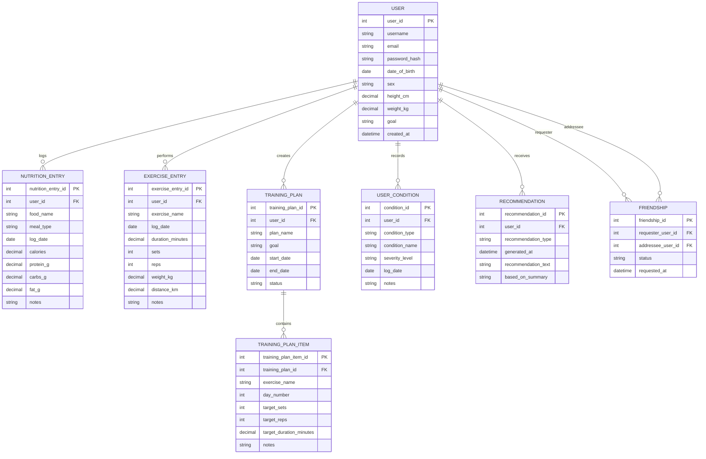

# Simple ERD Design for Fitness Web Application

## Overview

This database design supports the core functionality of the website:

- user login
- users can add friends
- users can log nutrition
- users can log exercise
- users can create training plans
- users can record mood and injury conditions
- structured user data can be sent to a Large Language Model (LLM) API
- LLM recommendations can be stored and shown back to the user

---

## Main Entities

### 1. User

Stores account and profile information.

**Attributes:**

- `user_id` (PK)
- `username`
- `email`
- `password_hash`
- `date_of_birth`
- `sex`
- `height_cm`
- `weight_kg`
- `goal`
- `created_at`

---

### 2. Friendship

Stores friendship relationships between users.

**Attributes:**

- `friendship_id` (PK)
- `requester_user_id` (FK -> User.user_id)
- `addressee_user_id` (FK -> User.user_id)
- `status`
- `requested_at`

**Purpose:**
Allows users to add each other as friends.

---

### 3. NutritionEntry

Stores nutrition records for each user.

**Attributes:**

- `nutrition_entry_id` (PK)
- `user_id` (FK -> User.user_id)
- `food_name`
- `meal_type`
- `log_date`
- `calories`
- `protein_g`
- `carbs_g`
- `fat_g`
- `notes`

**Purpose:**
Allows users to log their daily nutrition intake.

---

### 4. ExerciseEntry

Stores exercise records for each user.

**Attributes:**

- `exercise_entry_id` (PK)
- `user_id` (FK -> User.user_id)
- `exercise_name`
- `log_date`
- `duration_minutes`
- `sets`
- `reps`
- `weight_kg`
- `distance_km`
- `notes`

**Purpose:**
Allows users to log workouts and exercise activities.

---

### 5. TrainingPlan

Stores user training plans.

**Attributes:**

- `training_plan_id` (PK)
- `user_id` (FK -> User.user_id)
- `plan_name`
- `goal`
- `start_date`
- `end_date`
- `status`

**Purpose:**
Allows a user to create and manage a training plan.

---

### 6. TrainingPlanItem

Stores the exercises inside each training plan.

**Attributes:**

- `training_plan_item_id` (PK)
- `training_plan_id` (FK -> TrainingPlan.training_plan_id)
- `exercise_name`
- `day_number`
- `target_sets`
- `target_reps`
- `target_duration_minutes`
- `notes`

**Purpose:**
Breaks a training plan into daily exercise items.

---

### 7. UserCondition

Stores user mood and injury-related information.

**Attributes:**

- `condition_id` (PK)
- `user_id` (FK -> User.user_id)
- `condition_type` (`mood` or `injury`)
- `condition_name`
- `severity_level`
- `log_date`
- `notes`

**Purpose:**
Allows the system to store extra conditions that may affect recommendations.

---

### 8. Recommendation

Stores recommendations generated by the LLM.

**Attributes:**

- `recommendation_id` (PK)
- `user_id` (FK -> User.user_id)
- `recommendation_type`
- `generated_at`
- `recommendation_text`
- `based_on_summary`

**Purpose:**
Stores nutrition and exercise recommendations produced by the AI model.

---

## Relationship Summary

- One **User** to many **NutritionEntry** records.
- One **User** to many **ExerciseEntry** records.
- One **User** to many **TrainingPlan** records.
- One **TrainingPlan** to many **TrainingPlanItem** records.
- One **User** to many **UserCondition** records.
- One **User** to many **Recommendation** records.
- One **User** to many other users through **Friendship**.

---

